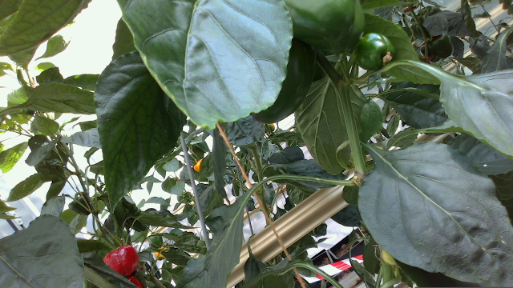
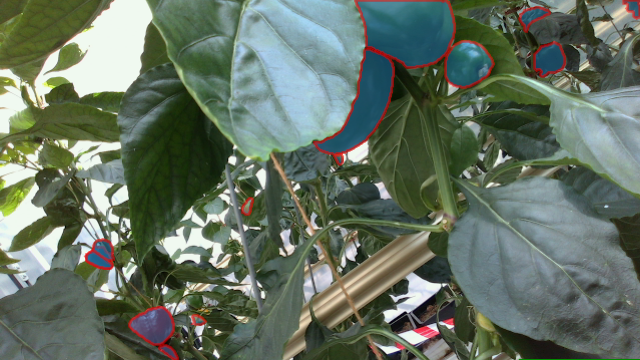

# yolo_segmentation_ros

Sweet pepper detection+segmentation+tracking via YOLOv8. Alternative to `agrobot_mrcnn_ros` and `mask_rcnn_ros`. Uses `mask_rcnn_ros/Result` and `yolact_ros_msgs/Detections` for publishing the results.

Watch my quick experiment on YouTube (`yolov8l-seg-V1`).

[](https://youtu.be/ferqPKNXs0U)

Also for `yolov8n-seg-V2`: https://youtu.be/UmDr89TXKYQ

## Installation

Choose **a** or **b**.

### a) User Python Env

Easiest way:

```bash
$ pip install -r requirements.txt
```

### b) Virtual Python Env

If you don't want to mess up with your current environment.

```bash
$ mkdir "$HOME/.virtualenvs"
$ cd "$HOME/.virtualenvs"
$ python3 -m venv yolo_segmentation_ros
$ source yolo_segmentation_ros/bin/activate
$ cd ~/catkin_ws/src/yolo_segmentation_ros
$ pip install -r requirements.txt
```

If you choose this option, don't forget to update `yolo_segmentation_ros_python` param in the `launch/start.launch` file.

### Download Weights

**Read First!** This table is copied from [here](https://docs.ultralytics.com/tasks/segment/#models).

| Model                                                        | mAPbox 50-95 | mAPmask 50-95 | Speed CPU ONNX (ms) | Speed A100 TensorRT (ms) | params (M) | FLOPs (B) |
| :----------------------------------------------------------- | :----------- | :------------ | :------------------ | :----------------------- | :--------- | :-------- |
| [YOLOv8n-seg](https://github.com/ultralytics/assets/releases/download/v0.0.0/yolov8n-seg.pt) | 36.7         | 30.5          | 96.1                | **1.21**                 | 3.4        | 12.6      |
| [YOLOv8s-seg](https://github.com/ultralytics/assets/releases/download/v0.0.0/yolov8s-seg.pt) | 44.6         | 36.8          | 155.7               | **1.47**                 | 11.8       | 42.6      |
| [YOLOv8m-seg](https://github.com/ultralytics/assets/releases/download/v0.0.0/yolov8m-seg.pt) | 49.9         | 40.8          | 317.0               | **2.18**                 | 27.3       | 110.2     |
| [YOLOv8l-seg](https://github.com/ultralytics/assets/releases/download/v0.0.0/yolov8l-seg.pt) | 52.3         | 42.6          | 572.4               | **2.79**                 | 46.0       | 220.5     |
| [YOLOv8x-seg](https://github.com/ultralytics/assets/releases/download/v0.0.0/yolov8x-seg.pt) | 53.4         | 43.4          | 712.1               | **4.02**                 | 71.8       | 344.1     |

- mAPval values are for single-model single-scale on COCO val2017 dataset.
- Speed averaged over COCO val images using an Amazon EC2 P4d instance.

**Download Model:** Models are named in `yolov8[SIZE]-seg-[VERSION]`. Always prefer latest version of that specific model size. Sizes are nano (**n**), small (**s**), medium (**m**), large (**l**), x-large (**x**). [DOWNLOAD the `weights/best.pt`](https://drive.google.com/drive/folders/1aZ4MpL7zXARpdr7hky6iucenSEoaDH9W?usp=sharing) and place it into the `model` folder. Small models run faster but worse, large models run slower but better.  Currently recommended best large model for GPU is `yolov8l-seg-V1`, best nano model for CPU is `yolov8n-seg-V2`.

Tested on;

- Ubuntu 20.04 + ROS Noetic
- Ryzen 5900HX + RTX3080M 16GB
- Nvidia Driver 525.105.17
- CUDA 11.7
- **ultralytics 8.0.114**

## Training

You can skip this step if you would like to use pre-trained models for sweet pepper detection.

This dataset also may be available [here](https://drive.google.com/drive/folders/1_vcGtZ2e_fBL40v9YXFtJwGn-FRkIhee?usp=sharing). If you can download the dataset you can skip to the training part.

 ```bash
 $ cd yolo_segmentation_ros/train
 ```

**Prepare Dataset:** Follow the steps below.

1. **(Mandatory)** Prepare BUP20
   1. Download [BUP20](http://agrobotics.uni-bonn.de/sweet_pepper_dataset/) dataset and extract `BUP20.tar.gz` into a folder. (it should have the name `CKA_sweet_pepper_2020_summer`)
   2. Modify `DATASET_PATH` at the top of the notebook then run the notebook `train/bup20_to_yolov8.ipynb ` to create yolov8 dataset. 
2. **(Optional)** Prepare Sweet Pepper and Peduncle Segmentation Dataset from Kaggle:
   1. Download [Sweet Pepper and Peduncle Segmentation Dataset from Kaggle](https://www.kaggle.com/datasets/lemontyc/sweet-pepper?resource=download) and extract into a folder. (it should have the name `dataset_620_red_yellow_cart_only`)
   2. Modify `DATASET_PATH` at the top of the notebook then run the notebook `train/dataset_620_to_yolov8.ipynb ` to create yolov8 dataset.
3. **(Mandatory)** Split train/validation using `split_train_val.ipynb`

**Training:** After these steps, the dataset should be ready. For training the model:

1. Run the script `train/train.py` for training. This should take about 15-20 mins.
2. Copy the `train/runs/segment/train/weights/best.pt` to `model/best.pt`

## Prediction

```bash
$ cd yolo_segmentation_ros/predict

# Predict a region of your screen:
$ python predict_screen.py

# Predict using your web-cam:
$ python predict_webcam.py

# Predict using a video:
$ python predict_video.py.py

# Predict using images:
$ python predict_images.py
```

## Auto-Annotation

Check `autoannotate` folder for scripts. For more information visit [this page](https://docs.ultralytics.com/models/sam/).

| Original                                      | Auto-annotated                               |
| --------------------------------------------- | -------------------------------------------- |
|  |  |


## ROS Node

The ROS node script is located here: `scripts/ros_node.py`

**TODO:** Tracking id's are computed but can't be published because there is no applicable fields in the output message types. Disable tracking by setting `~tracking` to False to reduce computations.

```bash
# Install dependency: sudo apt install ros-noetic-video_stream_opencv
$ roslaunch yolo_segmentation_ros demo.launch
```


## AGPL-3.0 License!?

[ultralytics](https://github.com/ultralytics/ultralytics) is a nice YOLOv8 package, but it comes with [AGPL-3.0 license](https://github.com/ultralytics/ultralytics/blob/main/LICENSE). If you would like to improve this package's license restrictions and performance, replace this library with [super-gradients](https://github.com/Deci-AI/super-gradients) ([Apache-2.0 license](https://github.com/Deci-AI/super-gradients/blob/master/LICENSE.md)) which has YOLOv8-NAS outperforming ultralytics's YOLOv8. There are pretty good examples on its [Github Readme](https://github.com/Deci-AI/super-gradients) and [here](https://www.kaggle.com/general/406701).
